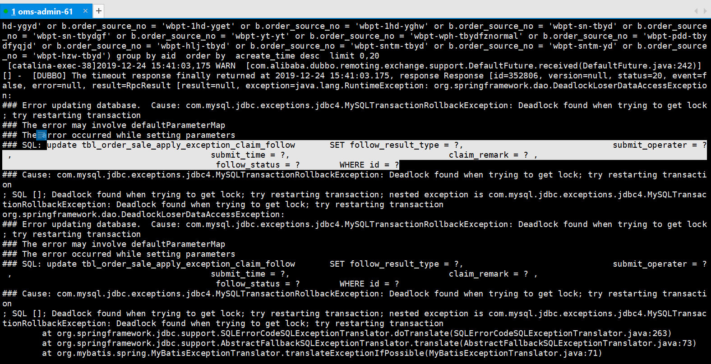

### 遇见的问题
今天在生产遇见一个问题，服务器报错，日志记录如下图：

日志提示为 update table where id=? 造成的死锁。

### 探索过程
询问DBA这个时间段有些什么操作，都有哪些sql在执行，根据sql执行形况找到对应的业务代码，查看代码是否有问题，代码业务层很简单，并没有什么复杂的逻辑，就是一个dubbo服务调用，被调用方就一个select，然后一个遍历，遍历里update，没有其他逻辑了。最后并没有在代码层面找到问题所在。
于是想让测试同学帮忙重新一下报错场景，然而测试也并未重现出来。通过我一步步的尝试与排查，初步定位到了原因：生产和测试环境的数据差异比较大，同样的条件查询，生产数据量很大，而测试环境数据量比较少，导致线上select耗时过长，造成dubbo接口调用超时(超时时间设置为120秒)。而测试环境并不会造成超时的情况，所以测试环境没有线上的问题。
第一步已经确认，但是为什么会造成死锁的发生？
于是继续发掘真相，突然想到RPC服务一般都会有重试机制，虽然这部分相关的配置我并不了解(因为我们项目都是分工进行的，而且我也只是在原来的基础上修改，配置这部分我恰好没有接触到，所以并不清楚具体的配置是什么)，但是我觉得很可能和这个有关，于是询问同事相关的配置以及重试机制是怎样的。同事说我们的重试机制为自动重试2次。突然我就豁然开朗了。于是得到以下结论：
- 线上慢sql查询耗时过长，在select之后遍历update的时候，服务调用超时了。
- dubbo服务调用超时，并不会终止当前的进程，他还会继续执行。
- 因为存在事务，这里的事务为数据库层的事务，上一个事务还未commit，这时候又自动重试，导致select脏读，又遍历update，这时候两个update where id=? ,id重复了，导致死锁。(根据id进行update只会锁行)
到此，问题原因水落石出。

### 解决方式
讲讲最后的解决措施吧，首先sql没办法优化，也不好优化，故忽略sql优化这部分。
既然不能优化sql，那还是得保证查询耗时得问题呀，于是对查询进行了分页，每次限制查多少条数据，这样也算减少了一些查询耗时了，然后再在调用方增加声明式事务，避免重试机制的数据脏读。

### 尾言
这就是我本次遇见及解决问题的全过程，分享一下，加深理解。