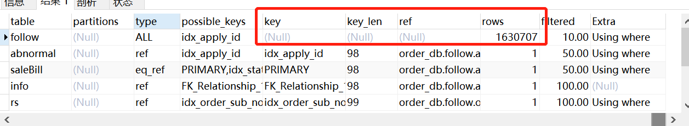
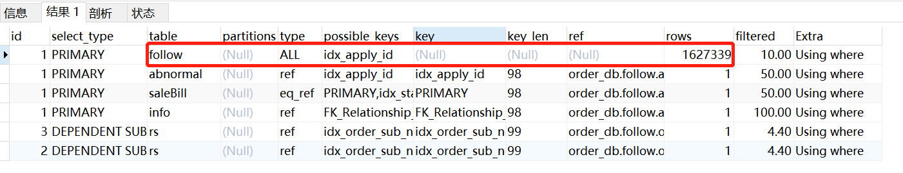
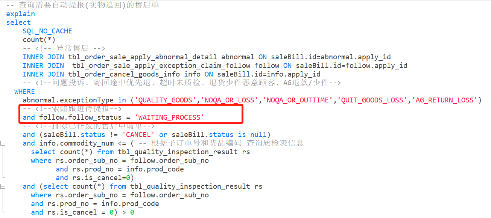
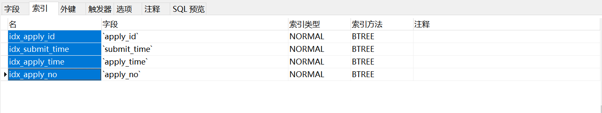
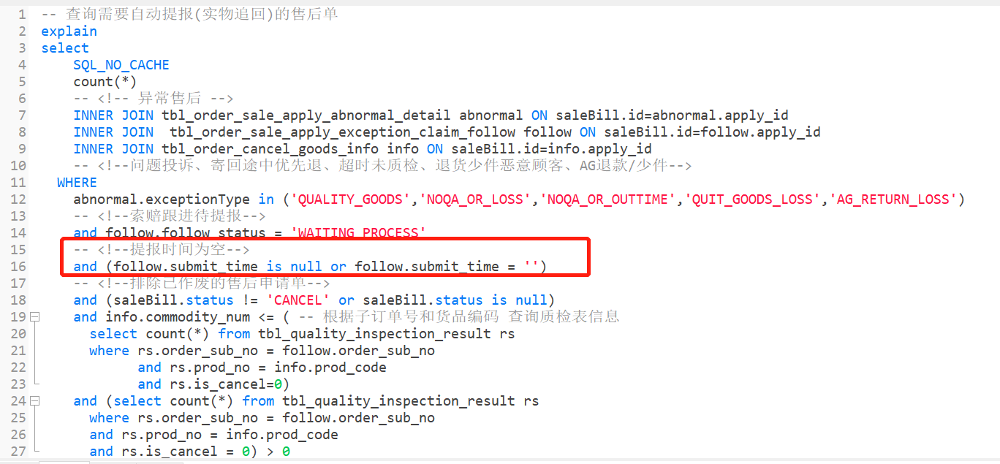
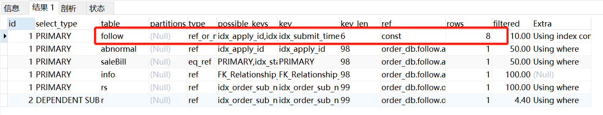

### 遇见的问题
之前写了一个调度，是专门用来处理一些数据的，调度配置如下图：

但是今天客服反应，说很久之前的数据都还没有提报，导致人工工作量巨增。
于是我把sql拿出来查了一把，发现居然堆积了巨多数据，之前都没有那么多数据的，我想应该和最近的三八大促有关，而且调度处理的这部分数据都是和售后有关的。
    我分析了以下原因：
        *1、调度扫描数据的sql每次limit500，很明显，目前的数据已经超出当初预计的范围*
        *2、调度之所以limit500，是因为怕sql一次性查出太多数据，执行增加耗时，导致连接超时（可以从页面输入url触发调度，超时时间为60秒）*
        *3、调度每两小时执行一次，可能两小时内产生的数据已经成倍增加，导致数据处理不及时，形成数据堆积*

### 探索过程
我把sql拿出来看了一下执行计划，不看不知道，一看吓一跳，居然扫了全表

执行计划和测试库不一样，很明显，测试库的数据并没有生产那么多，所以从测试环境是看不出来效果的。那么问题来了，当时为什么没有把sql拿出来放生产跑一把看看执行计划？嘿嘿，没想到啊没想到...而且当时这个需求情况比较急，没多少时间，不过说到底，还是大意了(自己的锅，甩是没有用的)

蹩整这些没有用的了，赶紧把sql优化好才是关键。于是我开始从sql的各种条件中寻找突破口，首先看看执行计划，哪些表走了索引，哪些表没有走索引：

从图片可以看出，就这个follow表没有走索引，那肯定就是因为这个表的相关条件导致扫描全表。
于是我把这个表的查询条件找出来：

这个表的过滤条件只有这一个，于是我又去看了一把表结构，看看这个表都有哪些索引：

所以，到这里已经很明显了吧，我的查询条件并没有在索引的列表中。那怎么办呢？只能看看能不能把索引的字段加上了。
于是我从业务的角度出发，去寻找看看有没有参考的价值，有的时候真是就怕碰到问题不思考，不会变换角度思考问题，这还真给我找到一个突破口。既然sql捞的是待提报的数据，那么提报时间必然是空值，刚好索引列表中又有一个提报时间的索引，于是我把这个条件加上，再看看执行计划：

搞定收工！

### 总结
通过这次的亲身经历，我觉得sql优化执行计划很重要！先看走没走索引，如果没走，看看是哪个表没走索引，然后就是想办法让它走索引，其实sql优化无非就是索引的问题。
